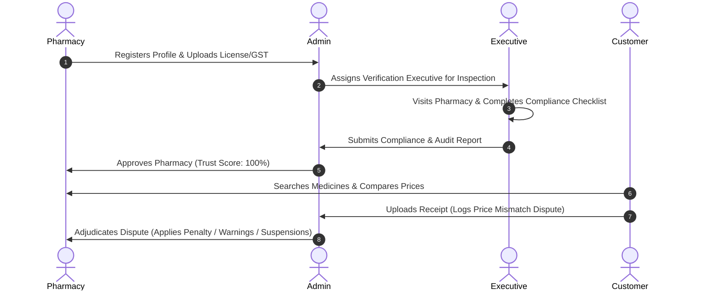

# 🛡️ MedSafe — Hyperlocal Medicine Security & Verification Platform

MedSafe is a premium, secure, and transparent web application designed to combat medicine counterfeits, enforce price transparency, and verify local pharmacies. It connects customers, pharmacies, physical inspectors (verification executives), and administrators in a single trust-based ecosystem.

---

## 🌟 Key Features

### 👤 1. Customer Portal
*   **Hyperlocal Medicine Discovery:** Search for medicines by brand name, generic name, salt composition, or category.
*   **Price Comparison:** Compare prices and availability across approved local pharmacies, sorted by the lowest price.
*   **AI Medicine Alternatives:** View generic/alternative salt recommendations to save up to 45% on healthcare.
*   **Dispute Lodging with OCR Invoice Scanning:** Scan and upload invoices. The platform's integrated OCR logic flags price inflation, matching receipt prices against registered inventory lists.

### 🏪 2. Pharmacy Portal
*   **Trust-Based Onboarding:** Seamless step-by-step registration requiring drug licenses, GST verification, and store information.
*   **Inventory Syncing:** Manage stock levels manually or sync automatically with billing systems (such as *MedSafe-Link*) to maintain real-time inventory and improve trust scores.
*   **Dispute Management:** Receive and respond directly to customer complaints regarding pricing or stock availability.

### 🏃‍♂️ 3. Verification Executive Portal
*   **Assigned Field Inspections:** View list of stores assigned for verification checks.
*   **On-Site Audit Checklist:** Step-by-step checklist ensuring validity of physical licenses, GST details, medicine storage temperatures, and expiration dates.
*   **Verification Reports:** Submit comprehensive compliance reports directly to the admin console.

### 👑 4. Super Admin Console
*   **Executive Dispatches:** Schedule and assign on-site verification dates for pending pharmacy stores.
*   **Verification Review Panel:** Analyze executive audit reports and grant final onboarding approvals.
*   **Fraud Adjudication Center:** Investigate customer complaints. Admin can penalize fraudulent stores (reducing trust score and issuing warnings) or dismiss false complaints.
*   **Audit Logging:** Trace every transaction and platform change through a secure audit trail.

---

## ⚙️ Tech Stack & Architecture

### Frontend
*   **Core:** React (Vite)
*   **Styling:** Tailwind CSS (configured for modern dark mode aesthetics)
*   **Icons:** Lucide React
*   **Charts & Analytics:** Recharts (for demand forecast graphs)
*   **Data Layer:** Hybrid API engine supporting MongoDB server endpoints with automatic **LocalStorage Fallback Database Engine** for seamless offline operation.

### Backend
*   **Runtime:** Node.js
*   **Framework:** Express.js
*   **Database:** MongoDB (via Mongoose)
*   **Security:** JSON Web Tokens (JWT) for authentication & bcrypt for password hashing

---

## 🔄 Platform Workflow



---

## 🚀 Getting Started

### Prerequisites
*   Node.js (v18+)
*   MongoDB Instance (if running in Server mode)

### 1. Setup Backend
1.  Navigate to the `/backend` directory.
2.  Install dependencies:
    ```bash
    npm install
    ```
3.  Configure environment variables in a `.env` file:
    ```env
    PORT=5000
    MONGODB_URI=your_mongodb_connection_string
    JWT_SECRET=your_jwt_secret_key
    ```
4.  Start the server:
    ```bash
    npm start
    ```

### 2. Setup Frontend
1.  Navigate to the `/frontend` directory.
2.  Install dependencies:
    ```bash
    npm install
    ```
3.  Start the Vite development server:
    ```bash
    npm run dev
    ```
4.  Open [http://localhost:5173](http://localhost:5173) in your browser.

---

