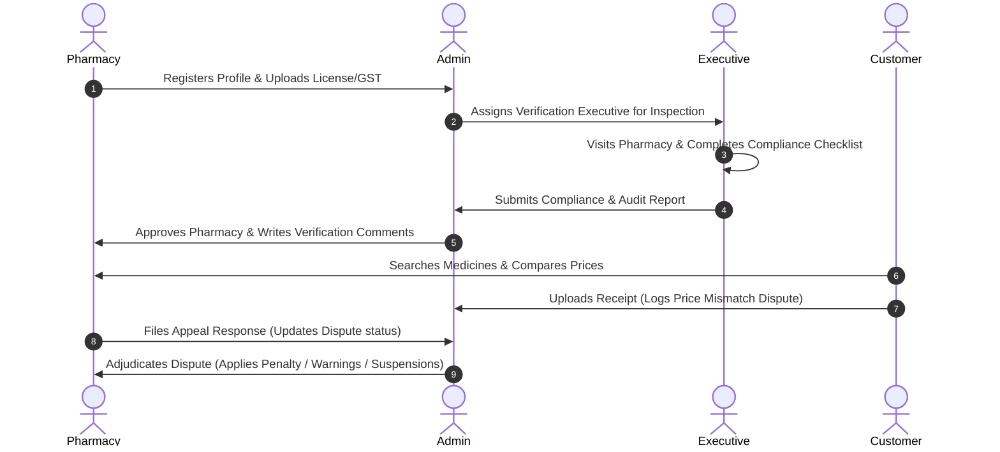

# 🛡️ MedSafe — Hyperlocal Medicine Security & Verification Platform

MedSafe is a premium, secure, and transparent web application designed to combat medicine counterfeits, enforce price transparency, and verify local pharmacies. It connects customers, pharmacies, physical inspectors (verification executives), and administrators in a single trust-based ecosystem.

---

## 🌟 Key Features

### 👤 1. Customer Portal
*   **Hyperlocal Medicine Discovery:** Search for medicines by brand name, generic name, salt composition, or category.
*   **Price Comparison:** Compare prices and availability across approved local pharmacies, sorted by the lowest price.
*   **AI Medicine Alternatives:** View generic/alternative salt recommendations to save up to 45% on healthcare.
*   **Dispute Lodging with OCR Invoice Scanning:** Scan and upload invoices. The platform's integrated OCR logic flags price inflation, matching receipt prices against registered inventory lists.
*   **Dynamic Dispute Lifecycle Statuses:** Disputes display contextually as **"Awaiting Store Response"** (when first lodged) or **"Under Admin Review"** (once the pharmacy owner files an official response appeal).

### 🏪 2. Pharmacy Portal
*   **Trust-Based Onboarding:** Seamless step-by-step registration requiring drug licenses, GST verification, and store information.
*   **Gated Inventory Syncing:** Gated view that locks inventory controls until the store is approved. Features automatic sync with POS billing systems (such as *MedSafe-Link*) and manual stock updates.
*   **Dispute Management & Appeals:** Review pricing mismatch disputes lodged against the store and submit official responses directly to the admin console.
*   **Separated Analytics & Inventory:** Dedicated tabs partition real-time metrics, status steppers, and trust levels from live stock SKU directories.

### 🏃‍♂️ 3. Verification Executive Portal
*   **Assigned Field Inspections:** View list of stores assigned for verification checks.
*   **On-Site Audit Checklist:** Step-by-step checklist ensuring validity of physical licenses, GST details, medicine storage temperatures, and expiration dates.
*   **Verification Reports:** Submit comprehensive compliance reports directly to the admin console.

### 👑 4. Super Admin Console
*   **Executive Dispatches:** Schedule and assign on-site verification dates for pending pharmacy stores.
*   **Physical Audit Approvals Workspace (Past & Present)**:
    *   **Active Reviews (Present)**: Evaluates audit reports and lets the SuperAdmin write custom verification comments. Includes controls to **Approve & Verify**, **Request Corrections**, or **Reject** stores.
    *   **Audit History (Past)**: Displays completed reviews and finalized decisions alongside locked, visible comments.
*   **Fraud Adjudication Center:** Investigate customer complaints. Admin can penalize stores (increasing warning points and issuing bans if warnings >= 3) or dismiss false complaints. Only responds to disputes once both parties have submitted data.
*   **Unified Directory & Dossier Registry**: Sliding dossier details panel with interactive owner-to-store cross-linking.
*   **Audit Logging:** Trace every transaction and platform change through a secure audit trail.

---

## ⚙️ Tech Stack & Architecture

### Frontend
*   **Core:** React (Vite)
*   **Styling:** CSS & Tailwind CSS (configured for modern dark mode/clinical light theme hybrid aesthetics)
*   **Icons:** Lucide React
*   **Charts & Analytics:** Recharts (for demand forecast and stock distribution graphs)
*   **Data Layer:** Hybrid API engine supporting MongoDB server endpoints with automatic **LocalStorage Fallback Database Engine** for seamless offline operation.

### Backend
*   **Runtime:** Node.js
*   **Framework:** Express.js
*   **Database:** MongoDB (via Mongoose)
*   **Security:** JSON Web Tokens (JWT) for authentication & bcrypt for password hashing
*   **Dynamic Trust Score Engine**: Dynamically calculates trust scores on-the-fly:
    *   *Base:* 100%
    *   *Warnings Penalty:* -20% per warning point.
    *   *Active disputes penalty:* -10% per pending complaint.
    *   *Inventory penalty:* -15% for empty inventories in approved stores.

---

## 🔄 Platform Workflow



---

## 🚀 Getting Started

### Prerequisites
*   Node.js (v18+)
*   MongoDB Instance (if running in Server mode)

### 1. Setup Backend
1.  Navigate to the `/backend` directory.
2.  Install dependencies:
    ```bash
    npm install
    ```
3.  Configure environment variables in a `.env` file:
    ```env
    PORT=5000
    MONGODB_URI=your_mongodb_connection_string
    JWT_SECRET=your_jwt_secret_key
    ```
4.  Start the server:
    ```bash
    npm run dev
    ```

### 2. Setup Frontend
1.  Navigate to the `/frontend` directory.
2.  Install dependencies:
    ```bash
    npm install
    ```
3.  Start the Vite development server:
    ```bash
    npm run dev
    ```
4.  Open [http://localhost:5173](http://localhost:5173) in your browser.

---
